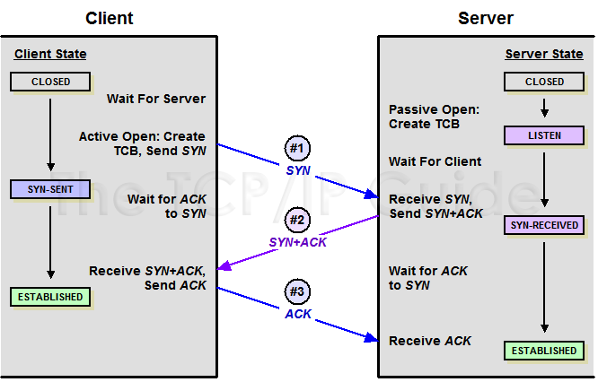

# 从输入URL到返回数据过程中的知识

## DNS
当输入URL时，浏览去会先去寻找域名所对应的IP地址。**DNS**的作用就是通过域名查询到具体的IP。
当在浏览器中想要访问`www.google.com`时，会通过进行以下操作：
1. 本地客户端向服务器发起请求查询IP地址
2. 查看浏览器有没有该域名的IP缓存
3. 查看操作系统有没有该域名的IP缓存
4. 查看HOST文件有没有该域名的解析配置
5. 如果都没有的话，会通过直接去DNS根服务器查询，首先查询`com`这个一级域名的服务器
6. 然后去该服务器查询`google.com`这个二级域名
7. 接下来查询`www.google.com`这个三级域名的地址
8. 返回给DNS客户端并缓存起来

以上过程是**DNS递归查询**，它是由系统配置的DNS服务器做请求，得到结果后将数据返回给客户端；还有一种**DNS迭代查询**，它是由客户端去做请求。
DNS解析过程中向服务器发送的请求会根据情况使用TCP或者UDP协议
- 通过**UDP**去进行一些数据量少的请求，此时用到UDP性能快的优势
- 通过**TCP**去进行数据量大且需要数据保证完整有序的请求，保证数据的正确及完整性

当浏览器获取域名IP地址后，就会通过TCP协议与服务器建立连接。
## TCP
TCP建立连接需要进行三次握手
最开始两端都为CLOSED状态。通信开始前，双方都会创建TCB（一个包含了协议需要的很多内容的数据结构）。服务器创建完TCB后就进入LISTEN状态，此时开始等待客户端发送数据。
### 第一次握手
客户端向服务端发送连接请求报文段（SYN）。请求发送后，客户端进入SYN-SENT状态。
### 第二次握手
服务端收到客户端连接请求报文段后，如果同意连接，就会发送一个应答（ACK + SYN），该应答中也会包含自身的数据通讯初始序号，发送完之后便进入SYN-RECEIVRD状态。
### 第三次握手
客户端收到连接同意的应答后，还要向服务端发送一个确认报文（ACK）。客户端发完这个报文段后便进入ESTABLISHED状态，服务端收到这个应答后也进入ESTABLISHED状态，此时连接建立成功。
> 第三次握手可以包含数据，通过TCP快速打开（TFO）技术。客户端和服务端存储相同cookie，下次握手时发出cookie达到减少RTT（一次请求来回的时间）的目的。
> 连接需要第三次握手的原因是防止失效的连接请求报文被服务端接收，从而产生错误。

